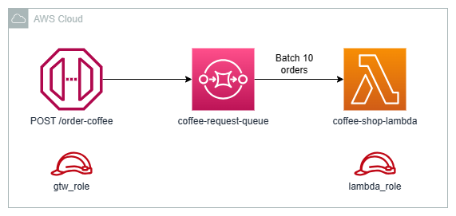

# CoffeShop AWS

Project to test integration between API Gateway + SQS + Lambda



## Resources

- API Gateway
- SQS Queue
- Roles/Policies
- Lambda - Golang

## Create Bynaries

``` bash
cd app;; $Env:GOOS = "linux";; go build -o ./tf_generated/coffee-shop-lambda
```

## Terraform - Infrastructure

Follow these steps to provision the infrastructure using Terraform:

1. Initialize the Terraform working directory:

    ``` bash
    terraform init
    ```

2. Preview the changes that will be applied:

    ``` bash
    terraform plan
    ```

3. Apply the changes and create the infrastructure:

    ``` bash
    terraform apply
    ```

## Request Example

``` json
curl --request POST \
  --url https://<api-gateway>.execute-api.us-east-1.amazonaws.com/coffee \
  --data '{
    "name": "Jean Jacques",
    "order": {
        "value": 10.2,
        "item": "Mocaccino"
    }
}'
```
